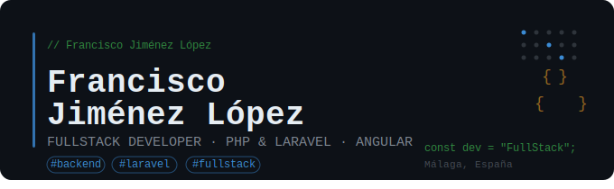

 

 
 

 

---

## 🧑‍💻 Sobre mí

Desarrollador Web Fullstack especializado en el ecosistema **PHP / Laravel** con sólida experiencia en el ciclo de vida completo del desarrollo: desde el modelado de bases de datos relacionales hasta la integración de APIs REST y el despliegue de componentes frontend dinámicos.

- 🌱 Explorando **TypeScript** y arquitecturas modernas con **Angular**
- ⚡ Me apasiona resolver problemas técnicos complejos y adaptarme rápido a nuevos entornos
- 🎓 Técnico Superior en **DAW** – CIPFP Alan Turing (2023–2025)

---

## 🛠️ Stack Tecnológico

### Backend

### Frontend

### Base de Datos

### Herramientas

---

## 📊 Estadísticas de GitHub

---

## 🌍 Idiomas

| Idioma | Nivel |
|---|---|
| 🇪🇸 Español | Nativo |
| 🇬🇧 Inglés | Intermedio B1 · Documentación técnica |

---

### 💬 ¿Hablamos?

Si tienes un proyecto interesante o quieres colaborar, ¡no dudes en escribirme!

